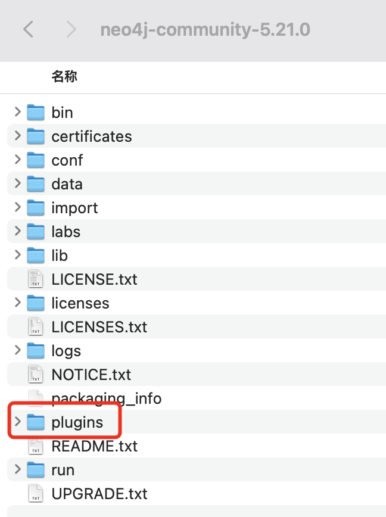
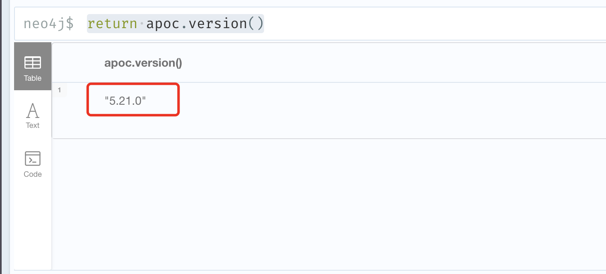
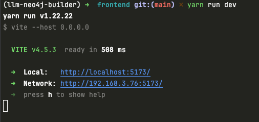
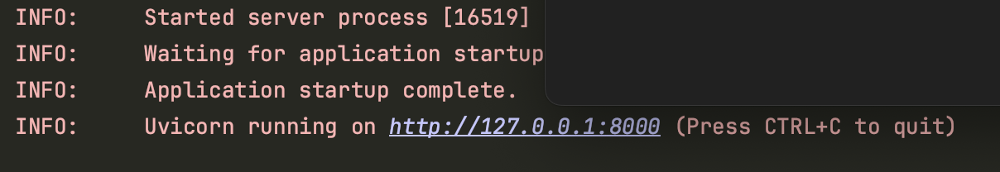
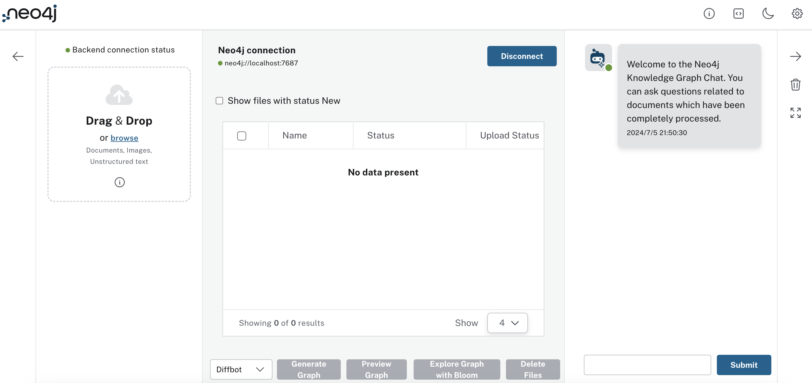

## 项目本地启动（详细指导）:smile_cat:

#### 1. 安装neo4j :hamburger:

- 安装neo4j 5.21.0 （⚠️version>=5.15）

- Neo4j安装apoc插件

  - [x] 下载[插件地址](https://github.com/neo4j/apoc/releases)

  - [x] 以5.21.0版本为例，将插件[apoc-5.21.0-core.jar](https://github.com/neo4j/apoc/releases/download/5.21.0/apoc-5.21.0-core.jar)拷贝至neo4j安装目录中的plugins文件夹下，如图所示

    
    
    - [x] 启动neo4j  (启动命令在neo4j安装目录的bin文件夹中，因此切换到bin目录中)
    
    ```bash
    ./neo4j start
    ```
    
    启动成功显示如下：
    
    ```html
    Starting Neo4j.
    Started neo4j (pid:17111). It is available at http://localhost:7474
    There may be a short delay until the server is ready.
    ```
    
    - [x] 验证apoc插件是否安装成功
    
      - 浏览器访问http://localhost:7474，设定密码，进入neo4j可视化界面
    
      - 输入cypher
    
        ```cypher
        return apoc.version()
        ```
        
      - 安装成功显示如下:
      
        
------


#### 2. 准备前端环境 :walking_man:

- 安装node.js (version >20) :package:

- 安装yarn

⚠️<!--node和yarn的安装自行查阅，本项目不专注于前端-->


- 在**frontend**文件夹下创建配置文件**.env**,配置文件内容如下：

```yaml
#后端开启的端口，默认是8000
BACKEND_API_URL="http://localhost:8000"
BLOOM_URL="https://workspace-preview.neo4j.io/workspace/explore?connectURL={CONNECT_URL}&search=Show+me+a+graph&featureGenAISuggestions=true&featureGenAISuggestionsInternal=true"
REACT_APP_SOURCES="local"
LLM_MODELS="智谱,百川,月之暗面,通义千问,深度求索,零一万物,Diffbot,OpenAI GPT 3.5,OpenAI GPT 4o"
ENV="DEV"
TIME_PER_CHUNK=4
TIME_PER_PAGE=50
CHUNK_SIZE=5242880
GOOGLE_CLIENT_ID=""
```

  :facepunch:可以根据自己的需求，自行修改，也可以使用默认配置

------


#### 3. 启动前端 :leaves:

```bash
cd frontend
yarn
yarn run dev
```

运行成功显示如下：



使用浏览器访问

```html
 http://localhost:5173/
```

------


#### 4. 后端配置 :dango:

- 在**backend**文件夹下创建配置文件**.env**，配置内容如下：

  只需填写API key  :smiley:

```yaml
OPENAI_API_KEY = ""

#智普ai
ZHIPUAI_API_KEY = "填写你的api key"
ZHIPUAI_API_URL = "https://open.bigmodel.cn/api/paas/v4/"

#通义千问
QWEN_API_KEY = "填写你的api key"
QWEN_API_URL = "https://dashscope.aliyuncs.com/compatible-mode/v1"

#百川
BAICHUAN_API_KEY = "填写你的api key"
BAICHUAN_API_URL = "https://api.baichuan-ai.com/v1/"

#月之暗面
MOONSHOT_API_KEY = "填写你的api key"
MOONSHOT_API_URL = "https://api.moonshot.cn/v1"

#deepseek
DEEPSEEK_API_KEY = "填写你的api key"
DEEPSEEK_API_URL = "https://api.deepseek.com"

#零一万物
LINGYIWANWU_API_KEY = "填写你的api key"
LINGYIWANWU_API_URL = "https://api.lingyiwanwu.com/v1"

DIFFBOT_API_KEY = ""
GROQ_API_KEY = ""

#使用从modelscope社区提供的embedding模型
EMBEDDING_MODEL = "iic/nlp_gte_sentence-embedding_chinese-base"
IS_EMBEDDING = "true"
KNN_MIN_SCORE = "0.94"
# Enable Gemini (default is False) | Can be False or True
GEMINI_ENABLED = False
# Enable Google Cloud logs (default is False) | Can be False or True
GCP_LOG_METRICS_ENABLED = False
NUMBER_OF_CHUNKS_TO_COMBINE = 6
UPDATE_GRAPH_CHUNKS_PROCESSED = 20
NEO4J_URI = ""
NEO4J_USERNAME = ""
NEO4J_PASSWORD = ""
NEO4J_DATABASE = ""
AWS_ACCESS_KEY_ID =  ""
AWS_SECRET_ACCESS_KEY = ""
LANGCHAIN_API_KEY = ""
LANGCHAIN_PROJECT = ""
LANGCHAIN_TRACING_V2 = ""
LANGCHAIN_ENDPOINT = ""
GCS_FILE_CACHE = "" #save the file into GCS or local, SHould be True or False
```

------
#### 5. 后端启动 :ear_of_rice:

- 安装依赖：

  ```bash
  pip install -r requirements.txt
  ```

- 启动程序（两种方式）, 后端程序在backend文件夹下

  - [x] 命令行启动

    ```bash
    uvicorn score:app --reload
    ```
  - [x] 在pycharm或者vscode等ide中，运行score.py

成功运行如下：
 


------


#### 6. 回到前端即可使用本项目:earth_africa:

以上步骤顺利执行之后，即可回到前端进行操作



